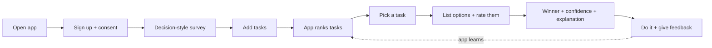
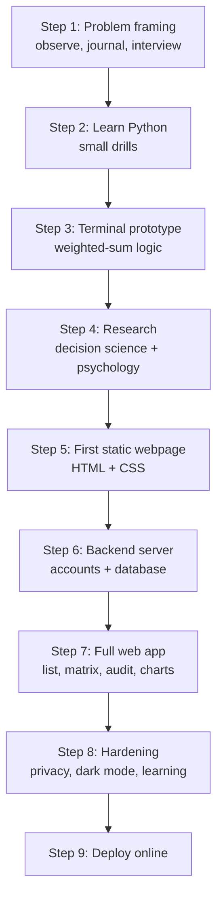
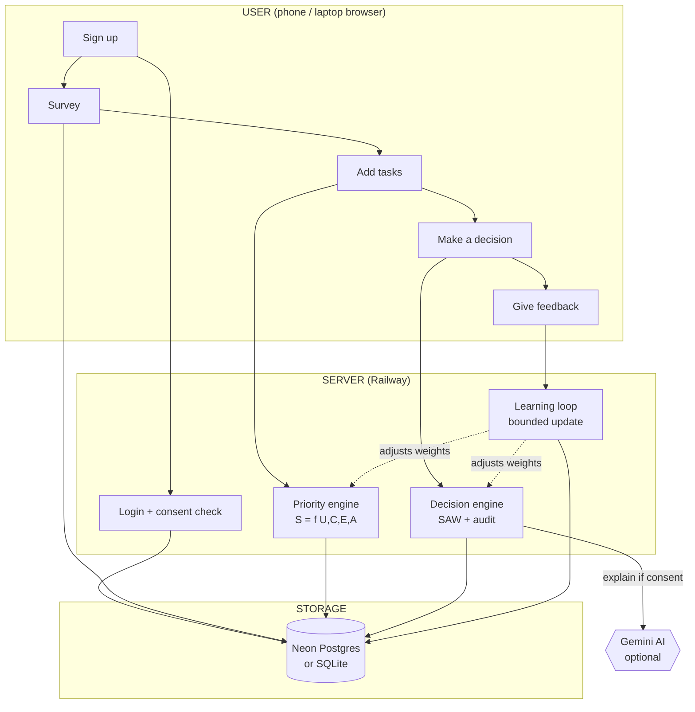
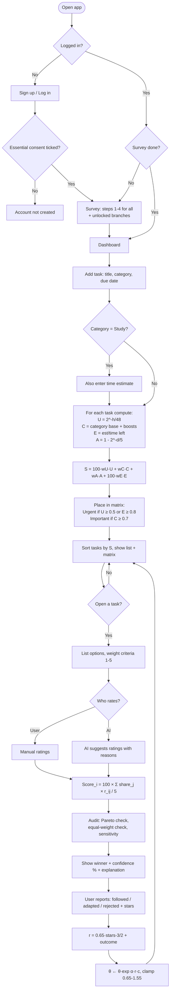
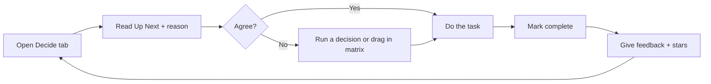

# Decide Well — Student Decision Lab
### IRIS National Fair — Engineering Project Report

| | |
|---|---|
| **Project** | Decide Well — a decision-making companion for students (ages 14–25) |
| **Suggested IRIS category** | Systems Software (alternatively: Behavioral & Social Sciences) |
| **Type** | Web application (software prototype, no custom hardware) |
| **Live link** | [project-app-production-a834.up.railway.app](https://project-app-production-a834.up.railway.app) |

> **IRIS submission checklist:** Synopsis (Abstract ≤250 words · Introduction & Objective
> 100–150 · Innovation 50–100 · Methodology 150–250 · Results & Conclusions 100–150 ·
> Acknowledgement & References 50–100) + full research paper + research data book +
> 90-second project video. The answers below form the engineering detail of the research paper.

---

## Q1. Scientific / Engineering Principles Involved

### 1.1 Decision mechanics (Multi-Criteria Decision Analysis)

| Principle | How it is used | Link |
|---|---|---|
| **Simple Additive Weighting (SAW)** | Scores each option inside a task | [Weighted sum model](https://en.wikipedia.org/wiki/Weighted_sum_model) |
| **Multi-Attribute Utility Theory (MAUT)** | Theory that allows weighted criteria to be added | [MAUT](https://en.wikipedia.org/wiki/Multi-attribute_utility) |
| **Pareto dominance** | Checks if the winner is best on every criterion | [Pareto efficiency](https://en.wikipedia.org/wiki/Pareto_efficiency) |
| **Sensitivity analysis** (Triantaphyllou & Sánchez, 1997) | Finds the smallest change that would flip the answer | [Paper](https://doi.org/10.1111/j.1540-5915.1997.tb01310.x) |
| **Clinical vs actuarial judgement** (Meehl, 1954) | Why the user may override the formula in rare cases | [Meehl](https://doi.org/10.1037/11281-000) |

**Option score formula (SAW):**

```
share_j  = w_j / Σ w                      (weights normalised so they sum to 1)
Score_i  = 100 × Σ_j ( share_j × r_ij / 5 )   (r_ij = rating 1–5 of option i on criterion j)
```

**Sensitivity formula:**

```
D   = Σ_j w_j · (v_Aj − v_Bj)          winner's total margin over runner-up
d_j = v_Aj − v_Bj                      margin from criterion j alone
δ_j = (1 − w_j) · D / (D − d_j)        smallest weight change that flips the winner
x   ≥ 5D / w_j                         smallest rating error that flips the winner
```

### 1.2 Priority mechanics (decay, growth and scheduling mathematics)

| Factor | Formula | Principle | Link |
|---|---|---|---|
| **U – Urgency** | `U = 2^(−hours_left / 48)`, overdue → 1 | Exponential decay, 48-hour half-life | [Exponential decay](https://en.wikipedia.org/wiki/Exponential_decay) |
| **C – Importance** | category base + 0.08 per chosen focus area | Utility calibration | — |
| **E – Effort** | `E = estimated_time / time_left` | Critical-ratio rule (operations research) | [Job-shop scheduling](https://en.wikipedia.org/wiki/Job-shop_scheduling) |
| **A – Aging** | `A = 1 − 2^(−days_open / 5)` | Anti-starvation aging (OS schedulers) | [Aging](https://en.wikipedia.org/wiki/Aging_%28scheduling%29) |

**Master priority formula:**

```
S = 100 × (w_U·U + w_C·C + w_A·A) + 100 × w_E·E        (capped at 100)
Base weights: w_U = 0.48, w_C = 0.36, w_A = 0.16, w_E = 0.15 (bonus only)
```

### 1.3 Statistics and learning-curve science (measuring improvement)

| Method | Formula / purpose | Link |
|---|---|---|
| **Hick–Hyman law** | `T_norm = T / log₂(options + 1)` — fair comparison regardless of option count | [Hick's law](https://en.wikipedia.org/wiki/Hick%27s_law) |
| **Theil–Sen estimator** | Median of pairwise slopes — trend not fooled by outliers | [Theil–Sen](https://en.wikipedia.org/wiki/Theil%E2%80%93Sen_estimator) |
| **Mann–Kendall test** | p-value for "is there really a trend?" | [Mann–Kendall](https://en.wikipedia.org/wiki/Mann%E2%80%93Kendall_test) |
| **Power law of practice** | `T = a · N^(−b)` — learning rate b | [Power law of practice](https://en.wikipedia.org/wiki/Power_law_of_practice) |
| **Shrinkage** | `score = 50 + (raw − 50) · n/(n+4)` — small samples trusted less | [Shrinkage](https://en.wikipedia.org/wiki/Shrinkage_%28statistics%29) |

### 1.4 Self-learning (online learning)

| Method | Formula | Link |
|---|---|---|
| **Multiplicative weights (Hedge)** | `θ_k ← θ_k · exp(α · r · c_k)` | [MWU](https://en.wikipedia.org/wiki/Multiplicative_weight_update_method) |
| **Reward** | `r = 0.65·(stars − 3)/2 + outcome` (outcome +0.35 / 0 / −0.35) | [Reward shaping](https://en.wikipedia.org/wiki/Reward_shaping) |
| **Decaying step size** | `α = 0.22 / (1 + events/25)` | [Stochastic approximation](https://en.wikipedia.org/wiki/Stochastic_approximation) |
| **Safety clamp** | every θ kept inside [0.65, 1.55] | — |
| **Trust** | `trust = events / (events + 12)` → shown to user as Level 1–5 | [Empirical Bayes](https://en.wikipedia.org/wiki/Empirical_Bayes_method) |

### 1.5 Behavioural science (explanation only — never changes a score)

[Eisenhower matrix](https://en.wikipedia.org/wiki/Time_management#The_Eisenhower_Method) ·
[Mere-urgency effect](https://doi.org/10.1093/jcr/ucy008) ·
[Decision fatigue](https://doi.org/10.1073/pnas.1018033108) ·
[Hyperbolic discounting](https://en.wikipedia.org/wiki/Hyperbolic_discounting) ·
[Planning fallacy](https://en.wikipedia.org/wiki/Planning_fallacy) ·
[Choice overload](https://doi.org/10.1037/0022-3514.79.6.995) ·
[Zeigarnik effect](https://en.wikipedia.org/wiki/Zeigarnik_effect)

### 1.6 Matrices used for decision-making

| Matrix | Size | Purpose |
|---|---|---|
| **Eisenhower matrix** | Urgency × Importance (2×2) | Sorts tasks into Do / Decide / Delegate / Delete |
| **Decision (weighted scoring) matrix** | Options × Criteria | Picks the best option inside a task |
| **Points-of-origin matrix** | Options × Criteria | Proves where every point of the score came from |
| **Sensitivity matrix** | Criterion × (δ, x) | Shows how fragile the result is |
| **Risk matrix** | Likelihood × Impact (5×5) | Project risk management |

**Eisenhower cut-offs:** Urgent if `U ≥ 0.50` (exactly one 48-hour half-life) or `E ≥ 0.80`;
Important if `C ≥ 0.70`.

---

## Q2. Basic Working Principle and Block Diagram

**Principle:** Priority is not a fixed property of a task — it depends on the person and the
moment. So the app never stores a priority; it stores facts (deadline, category, estimate)
and the user's profile, and **recalculates** the score every time the list is opened.



---

## Q3. Constraints (Time, Budget, Environment) — Problems Faced

| Type | Constraint | Problem it caused | How it shaped the design |
|---|---|---|---|
| **Time** | ~1 month, part-time, solo | No team, no reviewer, no tester | Built step by step; added self-checking (audit) features |
| **Time** | Learning Python, web and decision theory while building | Could not attempt everything at once | Terminal prototype → webpage → server → full app |
| **Budget** | Near ₹0 | No paid tools, no app-store fees | Free tiers for database and AI; web app instead of store app |
| **Environment** | Ordinary Windows laptop | No Mac, heavy tools too slow | Lightweight stack with no build tools |
| **Environment** | Users mostly on phones | Drag-and-drop didn't work on touch screens | Rebuilt dragging for touch |
| **Environment** | Unreliable internet in demos | Online services may fail | App works fully offline with a local database |
| **Environment** | Users aged 14–25 (some minors) | Privacy laws apply | Consent boxes unticked by default, data export/delete |

---

## Q4. Step-by-Step Procedure — How the App Was Made



1. **Problem framing** — Noted for two weeks where time really went. Found that students
   don't fail from laziness but from *re-deciding the same thing again and again*. Split
   the problem in two: *which task first?* and *which option inside a task?*
2. **Learning Python** — Official Python tutorial and Real Python. Rule: read one page, then
   write a small program using only that page (calculator → gradebook → input validation →
   saving to files → date/time maths).
3. **Terminal prototype** — A text-only program: answer a survey, list options, rate them
   1–5, get a winner. Proved the logic worked before any design was added.
4. **Research** — Replaced guessed formulas with published methods: SAW/MAUT, exponential
   decay for deadlines, aging from computer schedulers, Eisenhower matrix, sensitivity
   analysis, behavioural-science findings, privacy law (GDPR, India DPDP Act 2023).
5. **First webpage** — Plain HTML and CSS (learned on MDN): layout, then a grid for the
   2×2 matrix. Colours set as reusable variables from day one (made dark mode easy later).
6. **Backend server** — Learned FastAPI; built login, task storage and the scoring engine on
   the server. Tested every feature on the auto-generated test page before connecting UI.
7. **Full web app** — Survey wizard, ranked list, Eisenhower matrix with drag, decision
   workspace, audit panel, trend charts, assistant bubble.
8. **Hardening** — Privacy and consent system, dark mode, self-learning loop, fallbacks.
9. **Deployment** — Put online on Railway with a cloud database.

---

## Q5. Materials (BOM), Tools, Sensors, Software Versions

*No hardware is used — the "BOM" is the software stack.*

| Item | Version / Tier | Purpose | Cost |
|---|---|---|---|
| Python | 3.14.5 | Main programming language | ₹0 |
| FastAPI | 0.129.0 | Web server framework | ₹0 |
| Uvicorn | 0.40.0 | Runs the server | ₹0 |
| SQLAlchemy | 2.0.46 | Database connector | ₹0 |
| Pydantic | 2.12.5 | Checks all input data | ₹0 |
| PyJWT | 2.12.1 | Secure login tokens | ₹0 |
| HTML5 / CSS3 / JavaScript | — | The app's interface (no framework) | ₹0 |
| **Railway** | Usage-based | Hosting server (live website) | Low |
| **Neon Postgres** | Free tier | Cloud database | ₹0 |
| **SQLite** | Built-in | Offline backup database | ₹0 |
| **Google Gemini API** | Free tier | Plain-language explanations (optional) | ₹0 |
| VS Code | Latest | Code editor | ₹0 |
| Git | Latest | Version control | ₹0 |
| Chrome / Edge DevTools | — | Testing, mobile view, contrast checks | ₹0 |
| Windows 11 laptop | — | Development machine | Existing |

**"Sensors" (sources of live data):** the user's deadlines, click timings (thinking time
measured in the browser), star ratings, and follow/reject feedback.

---

## Q6 (12.1). Block Diagram / Architecture — How It Works for a New User



**Step by step for a new user:**

1. Opens the link → sees the privacy notice → ticks only the consents they want.
2. Creates an account (password stored scrambled/hashed).
3. Takes the survey — the first 4 steps for everyone, later sections unlock only for the
   areas the user chooses (Studies, Health, Career, etc.).
4. Adds tasks: title, category, due date (Study tasks also need a time estimate).
5. The server calculates U, C, E, A for every task and shows a **ranked list**, an
   **Eisenhower matrix** and an **"Up Next"** card.
6. User opens a task → lists options → weights criteria 1–5 → rates each option.
7. Presses **"Decide for me"** → gets the winner, a confidence %, a predicted satisfaction %
   and an **Audit** showing exactly how the score was built.
8. After acting, reports back (followed / adapted / rejected + stars) → the app adjusts
   itself slightly for next time.

---

## Q7 (12.2). Algorithm Flowchart / Pseudocode — Detailed User Flow



**Pseudocode — task ranking**

```
FOR each pending task:
    hours_left = deadline − now
    U = 1 if overdue else 2^(−hours_left / 48)
    C = category_base + 0.08 × (matching focus areas)
    E = estimated_time / time_left     (Study tasks only, else 0)
    A = 1 − 2^(−days_open / 5)
    S = 100(0.48·U + 0.36·C + 0.16·A) + 100(0.15·E)
    IF task already decided: S = S + 4          (momentum bonus)
    S = min(S, 100)
    quadrant = place(U, C, E)
SORT tasks by S, highest first
```

**Pseudocode — option decision**

```
FOR each criterion j:  w_j = user_weight × survey_multiplier × learned_multiplier
share_j = w_j / Σ w
FOR each option i:     Score_i = 100 × Σ ( share_j × rating_ij / 5 )
winner = highest score
CHECK: Pareto dominance, equal-weights winner, smallest flip (δ_j, x)
confidence = lead(30) + robustness(25) + input quality(20) + criteria breadth(15) + history(10)
```

---

## Q8 (12.3). Setup, Calibration, Operation Steps, Maintenance Notes

### 8.1 Setup

| Step | Action | Check |
|---|---|---|
| 1 | Install Python 3.11+ | `python --version` |
| 2 | Create a virtual environment and install requirements | No errors |
| 3 | Create the settings file (secret key; optional database URL and AI key) | File present |
| 4 | Start the server | "Running on 127.0.0.1:8000" |
| 5 | Open `/health` | `{"status":"ok"}` |
| 6 | Open the home page | Login screen appears |
| 7 | Deploy: push to Railway, set the same settings as environment variables | Live link opens |

Database tables are created automatically on first start — no manual setup.

### 8.2 Calibration

| Level | What is calibrated | Values |
|---|---|---|
| **Engine (fixed)** | Base weights | Urgency 0.48, Importance 0.36, Aging 0.16, Effort bonus 0.15 |
| | Half-lives | Urgency 48 h, Aging 5 days |
| | Category importance | Study 0.90, Career 0.85, Health 0.80, Travel 0.70, Personal 0.60, Purchases 0.50, Other 0.45, Entertainment 0.35 |
| **User (survey)** | Personal weights | e.g. deadline-driven → urgency up; each focus area → +0.08 importance |
| **Decision (each time)** | Criteria weights 1–5 and ratings 1–5 | Unrated options default to 3 → confidence drops sharply |
| **Learning (continuous)** | Multipliers θ | Clamped to [0.65, 1.55], trust = n/(n+12) |

**Learning levels shown to the user:**

| Level | Decisions with feedback | Trust | Label |
|---|---|---|---|
| 1 | 0 | 0.00 | Calibrating |
| 2 | 5 | 0.29 | Learning |
| 3 | 15 | 0.56 | Adapting |
| 4 | 35 | 0.74 | Tuned |
| 5 | 75 | 0.86 | Dialled in |

### 8.3 Operation



- **Daily:** check "Up Next" → do it → mark done → give feedback.
- **Weekly:** look at the matrix shape (too many "Delegate" tasks = chasing unimportant
  deadlines); check the trend charts on the Insights page.

### 8.4 Maintenance

| How often | Task |
|---|---|
| Every start | Check `/health` works |
| Weekly | Back up the database |
| Weekly | Check if AI explanations are falling back (quota / network issue) |
| Monthly | Check for library updates and security fixes |
| After colour changes | Re-measure text contrast in both themes |
| Privacy text changes | Update policy version so users are asked again |
| **Never** | Edit the database by hand, change the secret key on a live app, or share the settings file |

---

## Q9. Testing Method / Protocol (Technical)

Testing was manual and structured in six layers, each with a pass rule.

| Layer | What was tested | Example test | Pass rule |
|---|---|---|---|
| **1. Formula tests** | Engine maths vs hand calculation | 48 h left → U = 0.500; 96 h → 0.250; 5 days → A = 0.500 | Match to 3 decimals |
| **2. API tests** | Every server endpoint | User A asks for User B's task → "not found" | Correct response, no data leak |
| **3. Failure tests** | Remove AI key, database, internet | App keeps working, shows "Engine" label | No crash |
| **4. Interface tests** | Real phone + desktop, 320–2560 px | Press-and-hold drag on phone; no sideways scroll | Works on touch and mouse |
| **5. Validity tests** | Does the answer make sense? | Exam tomorrow vs film next month → exam first | Agrees with common sense |
| **6. Security tests** | Tampered login, injection, XSS | Fake token rejected; script in title shown as text | All attacks blocked |

**Key invariants checked after every change:**

```
Σ share_j = 1.000                       (weights always add to 1)
Σ row of points grid = Score_i          (audit adds up exactly)
S ≤ 100                                 (score cap)
Dragging in matrix → S unchanged         (override never changes score)
0.65 ≤ θ ≤ 1.55                         (learning stays bounded)
```

---

## Q10. "Why This and Why Not That" — Component Decisions

### Web app vs Flutter (and others)

| Option | Advantages | Disadvantages | Decision |
|---|---|---|---|
| **Web app** | No install — just a link; one code for phone + laptop; free; instant updates; easy to demo | No push notifications, no true offline mode | ✅ **Chosen** (main platform) |
| **Android APK (from the same web app)** | Installable app icon on Android phones; reuses the exact same app and server — no second codebase; can be shared directly as an APK file without Play Store fees | Needs internet to reach the server; iOS not covered | ✅ **Chosen** (in progress) |
| **Flutter** | One code for Android + iOS; smooth animations | New language (Dart) to learn in one month; heavy SDK + emulator on a basic laptop; would mean rebuilding the whole interface a second time | ❌ Rejected |
| **React Native** | Uses JavaScript | Needs complex build tools; still a separate app to maintain | ❌ Rejected |
| **Native Android/iOS** | Best performance | Two separate codes; iOS needs a Mac | ❌ Rejected |
| **PWA** | Installable web app | — | ⏳ Future upgrade |

**Main reason:** the heart of the project is an engine that must be *checkable*. A web app
keeps that engine in one place on the server, in Python — the browser only displays results.
The **Android APK is built from this same web app**, so phone users get an installable app
while everyone still uses the same engine, the same data and the same updates. This gives
the main benefit of Flutter (an app on the phone) without writing and maintaining a second
app.

### Other choices

| Chosen | Instead of | Why |
|---|---|---|
| FastAPI | Flask / Django | Automatic test page, built-in input checking, fast |
| Plain JavaScript | React / Vue | No build tools needed; simpler to learn and debug |
| SQLite + Postgres | Only one | Works offline *and* online with one setting |
| Gemini (free) | OpenAI / local AI | Free tier; local AI too slow on a laptop; AI is optional anyway |
| Touch-friendly pointer events | Standard drag-and-drop | Standard drag-and-drop does not work on phones |
| Separate "override" for matrix drag | Changing the score | Keeps the maths honest |

---

## Q11. Cost vs Performance Trade-off Table

### Hosting — what we use and why

The app is **hosted online on Railway** at `project-app-production-a834.up.railway.app`
(free Railway subdomain, HTTPS included). **Local hosting** (`127.0.0.1:8000`) is used for
development and as a backup for demos with no internet.

| Option | Cost | Start-up delay | Performance | Decision |
|---|---|---|---|---|
| **Railway** | Low, usage-based | Low | Good, always ready | ✅ **Live hosting** |
| **Local laptop** | ₹0 | None | Fastest, but not public | ✅ Development + offline backup |
| Render free | ₹0 | ~50 s after idle | Slow first load ruins demos | ❌ |
| Vercel / Netlify | ₹0 | Low | Not suited to this kind of server | ❌ |
| Fly.io | ~$5/month | Low | Good | Considered |
| VPS (DigitalOcean) | ~$4–6/month | None | Full control | Future, if users grow |
| **Neon Postgres** | ₹0 (0.5 GB) | Brief | Enough for this project | ✅ **Database** |

### Domain

| Option | Cost / year | Decision |
|---|---|---|
| **Railway subdomain** | ₹0 | ✅ Chosen — free, HTTPS included |
| `.in` domain | ~₹500–800 | Next step if the app goes public |
| `.com` domain | ~₹900–1,200 | Option later |

### Overall

| Component | Choice | Cost | What we gained | What we gave up |
|---|---|---|---|---|
| Hosting | Railway | Low | Always-on public link | Not strictly free |
| Database | Neon + SQLite | ₹0 | Online + offline | 0.5 GB limit |
| AI | Gemini free | ₹0 | Friendly explanations | Rate limits → fallback needed |
| Frontend | Plain JS | ₹0 | Fast, no build tools | One very large file |
| Testing | Manual | ₹0 (time) | Caught real bugs | No automatic safety net |
| **Total** | | **≈ ₹0 dev + low hosting** | | |

---

## Q12. Key Issues Encountered and How They Were Resolved

### Technical

| # | Problem | Cause | Solution |
|---|---|---|---|
| 1 | Drag-and-drop dead on phones | Standard drag-and-drop doesn't fire on touch | Rebuilt with pointer events: press-and-hold 320 ms on touch |
| 2 | Couldn't reach lower matrix boxes while dragging | Page doesn't scroll during drag | Auto-scroll near screen edges |
| 3 | Dragging seemed to change the score | Matrix position comes from the score | Separate "override" — score never changes |
| 4 | White flash in dark mode | Theme loaded after page drew | Tiny script sets theme before drawing |
| 5 | Survey too long (~40 questions) | Everything asked to everyone | Branching survey — sections unlock by choice |
| 6 | Browser and server gave different scores | Formula written twice | Kept only the server version |
| 7 | Weights didn't add up to 1 | Personalisation added without re-balancing | Normalise after every change |
| 8 | Audit rows off by small amounts | Rounded too early | Round only for display |
| 9 | One forgotten tab created a fake trend | Average is sensitive to outliers | Median + Theil–Sen + Mann–Kendall |
| 10 | Learning ran out of control | Updates had no limits | Clamp [0.65, 1.55] + decaying step size |
| 11 | AI model name stopped working | Model was retired | Auto fallback to other models + engine text |
| 12 | Giving a time estimate could lower a task's rank | Effort inside the average | Made effort a bonus only |

### Non-technical

| Problem | How it was handled |
|---|---|
| "Isn't this just a to-do list?" | A to-do list *stores* tasks; this *ranks, explains and lets you argue with* them — then show the Audit live |
| Questions that come out of nowhere | Three rules: (1) show it in the app instead of describing it; (2) if it's a limitation, admit it and explain the design decision; (3) if unknown, say "I don't know — here's how I'd find out" |
| "How do I know the score isn't made up?" | Open the Audit: every point traced, rows add up exactly, sensitivity shows how wrong an input must be to flip it |
| "Why not just ask ChatGPT?" | A chatbot can give different answers each time and can't show its maths; this engine is repeatable and checkable |
| Learning many things at once | Never started a new layer until the one below worked |
| No reviewer | Used automatic checks (sums, caps, bounds) instead of relying on own judgement |
| Too many feature ideas | Only kept features that could be explained in the Audit |
| Motivation dip | Built visible parts (design, logo, matrix) mid-project as a morale boost |

---

## Q13. Extended Data Tables, Component Datasheets, Risk Forms

### 13.1 Urgency data table — `U = 2^(−h/48)`

| Hours left | U | Urgent? |
|---|---|---|
| Overdue | 1.000 | Yes |
| 12 | 0.841 | Yes |
| 24 | 0.707 | Yes |
| **48** | **0.500** | **Yes (cut-off)** |
| 72 | 0.354 | No |
| 168 (1 week) | 0.088 | No |
| 720 (1 month) | 0.000 | No |

### 13.2 Aging data table — `A = 1 − 2^(−d/5)`

| Days open | 0 | 1 | 3 | **5** | 10 | 20 | 30 |
|---|---|---|---|---|---|---|---|
| A | 0.000 | 0.129 | 0.341 | **0.500** | 0.750 | 0.938 | 0.984 |

### 13.3 Reward table — `r = 0.65·(stars−3)/2 + outcome`

| Feedback | Reward |
|---|---|
| Followed + 5★ | +1.00 |
| Followed + 3★ | +0.35 |
| Adapted + 3★ | 0.00 |
| Rejected + 1★ | −1.00 |

### 13.4 Confidence score breakdown (0–100)

| Part | Max points |
|---|---|
| Lead over runner-up | 30 |
| Robustness (Pareto / sensitivity) | 25 |
| Input quality (user 1.00 / AI 0.80 / default 0.15) | 20 |
| Criteria breadth | 15 |
| Profile & history | 10 |

### 13.5 Component datasheet

| Component | Version | Licence | If it fails | Backup |
|---|---|---|---|---|
| FastAPI | 0.129.0 | MIT | App won't start | Standard server, replaceable |
| SQLAlchemy | 2.0.46 | MIT | No saving | — |
| Pydantic | 2.12.5 | MIT | Bad data gets in | Only checking point |
| PyJWT | 2.12.1 | MIT | No login | — |
| Neon Postgres | Free tier | — | Online DB down | SQLite |
| Gemini API | Free tier, 20 s timeout | — | No AI text | Engine explanations |
| Railway | Usage-based | — | Link offline | Run locally |

### 13.6 Risk form — Severity = Likelihood × Impact (1–5 each)

| ID | Risk | L | I | Severity | Mitigation |
|---|---|---|---|---|---|
| R1 | AI key expires / quota runs out | 4 | 2 | 8 Medium | Engine fallback, labelled |
| R2 | Free database limit exceeded | 3 | 2 | 6 Low | SQLite fallback, backups |
| R3 | Default secret key left in use | 3 | 5 | 15 **High** | Documented; must be changed |
| R4 | Personal data exposure (minors) | 2 | 5 | 10 Medium | Per-user data, hashing, consent, delete option |
| R5 | Light-mode text contrast too low | 5 | 2 | 10 Medium | Measured; fix planned |
| R6 | No automatic tests → bug slips in | 4 | 4 | 16 **High** | Six-layer manual testing + checklist |
| R7 | Learning drifts to bad settings | 2 | 3 | 6 Low | Clamp + reset button |
| R8 | User trusts score blindly | 3 | 4 | 12 Medium | Audit, sensitivity, override option |
| R9 | Live demo fails (no internet) | 3 | 3 | 9 Medium | Local offline version |

**Bands:** 1–6 Low · 8–12 Medium · 15–25 High
